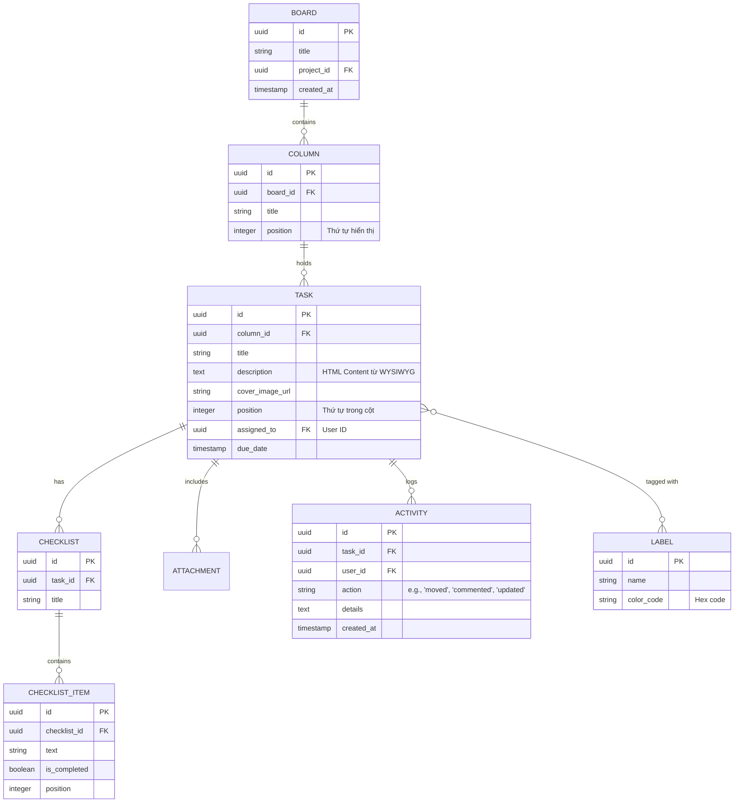

# Hướng dẫn Thiết kế Cơ sở dữ liệu cho Bảng Công việc (Kanban Board)

Tài liệu này cung cấp thiết kế cơ sở dữ liệu (Database Schema) phù hợp để hỗ trợ các tính năng hiện tại của màn hình Kanban Board, bao gồm quản lý cột, thẻ công việc, trình soạn thảo WYSIWYG, checklist và hoạt động.

## 1. Sơ đồ Quan hệ Thực thể (ER Diagram)

## 2. Chi tiết các Bảng chính

### 2.1. Bảng `columns` (Các cột trong bảng)
Dùng để quản lý các trạng thái như "Cần làm", "Đang làm", "Hoàn thành".
- `position`: Quan trọng để xử lý kéo thả thứ tự các cột. Nên dùng kiểu `FLOAT` hoặc `INTEGER`.

### 2.2. Bảng `tasks` (Thẻ công việc)
- `description`: Lưu dưới dạng **TEXT** hoặc **LONGTEXT**. Chứa mã HTML được sinh ra từ trình soạn thảo WYSIWYG ở Frontend.
- `position`: Thứ tự của task trong một cột. Khi kéo thả task, chỉ cần cập nhật `column_id` và `position`.

### 2.3. Bảng `checklists` & `checklist_items`
Một Task có thể có nhiều Checklist (Ví dụ: "Việc cần làm", "Tài liệu cần chuẩn bị").
- `checklist_items.is_completed`: Boolean để đánh dấu trạng thái hoàn thành.

### 2.4. Bảng `labels` & `task_labels`
Mối quan hệ nhiều-nhiều (Many-to-Many). Một task có thể có nhiều nhãn màu sắc.

## 3. Các lưu ý quan trọng cho Back-end

### 3.1. Phân cấp Dữ liệu (Hierarchy)
Khi Frontend gọi API lấy dữ liệu Board, nên trả về cấu trúc **Nested JSON** để tối ưu số lần gọi API:
- `Board` -> `Columns` -> `Tasks` (chỉ lấy thông tin cơ bản: title, labels, cover).
- Chi tiết Task (description, checklist, activity) chỉ nên gọi khi người dùng bấm vào mở Modal.

### 3.2. Xử lý Thứ tự (Ordering Logic)
Để hỗ trợ Drag-and-drop mượt mà:
- **Lựa chọn 1 (Đơn giản):** Dùng `position` kiểu số nguyên (1, 2, 3...). Khi chèn vào giữa, phải cập nhật lại toàn bộ `position` của các bản ghi phía sau.
- **Lựa chọn 2 (Tối ưu):** Dùng kiểu `DOUBLE`. Vị trí mới = (Vị trí trước + Vị trí sau) / 2. Cách này không cần cập nhật lại các bản ghi khác (Lexorank).

### 3.3. Bảo mật Nội dung (HTML Sanitization)
Vì `description` lưu trữ HTML từ trình soạn thảo:
- Back-end **BẮT BUỘC** phải sanitize (lọc) các tag nguy hiểm (như `<script>`) trước khi lưu vào database để tránh tấn công XSS.

### 3.4. Real-time (Khuyến nghị)
Nên sử dụng **WebSocket (Socket.io)** để cập nhật trạng thái bảng ngay lập tức cho các thành viên khác khi có người di chuyển task hoặc đổi tên cột.
